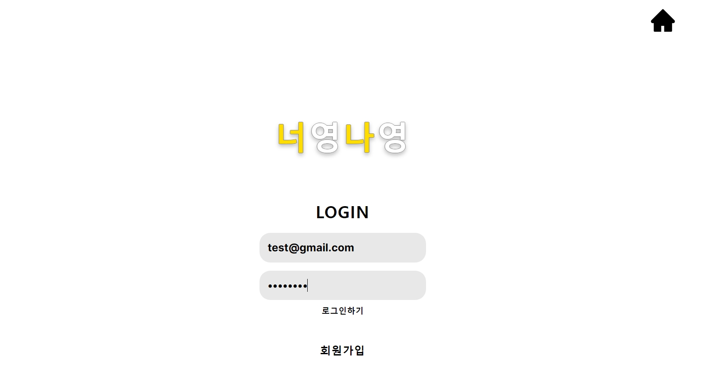
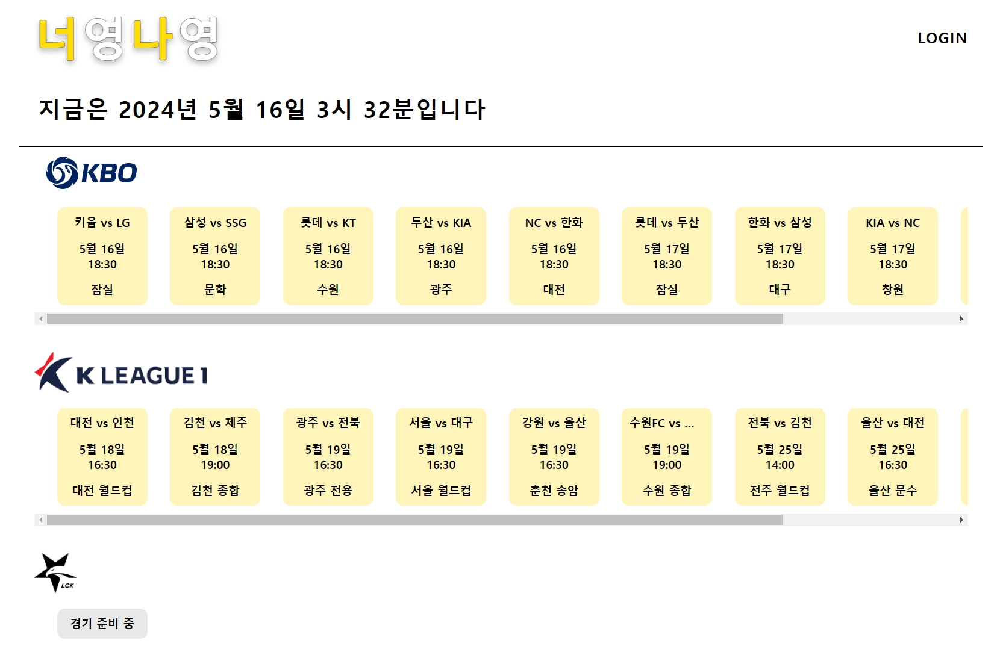
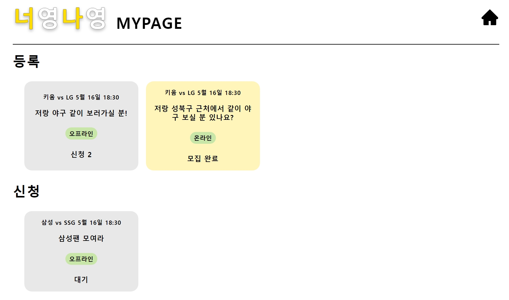

    

      <a href="https://yeong-512f5.web.app/" style="font-size: medium;"><b>  너영나영 사이트 바로가기 </b></a>   
    <a href="https://youtu.be/k50wjZlmplM" style="font-size: medium;"><b>  너영나영 시연 영상 </b></a>

 

   

## 프로젝트 소개
‘너하고 나하고’라는 의미를 담고 있는 제주어인 <너영나영>은 온라인과 오프라인에서 스포츠 경기를 함께 즐기고자 하는 사용자들을 연결하는 서비스입니다. 같이 할 사람을 구하는 사용자는 <너영나영>에서 원하는 스포츠 경기를 선택하면, 사용자의 기본 정보와 함께 같이 게시글이 올라갑니다. 다른 사용자들은 이미 올라온 게시글을 보고 함께 하려는 사람을 찾습니다.   

## 주요 기능
- 로그인, 회원가입 및 정보 수정
- 경기별 게시글 게시판
- 게시글 작성 및 조회, 매칭 신청
- 대기, 모집 마감, 현재 신청 인원을 통한 매칭 현황 제공
- 사용자의 프로필 카드를 보고 함께할 사람을 선택
- 모집 완료 시 매칭 성공된 사용자의 이메일 제공
   

## 개발 팀원
|                                                                                       조서림                                                                                       |
|:-------------------------------------------------------------------------------------------------------------------------------------------------------------------------------:|
| [   @srcho01](https://github.com/srcho01) | 
|                                                                                  기획, 디자인, FE                                                                                  |

  

## 사용 기술
<h4> ⚒️ Tech Skills ⚒️ </h4>

    
    
    
    

<h4> 🌐 Others 🌐 </h4>

    
    
     
    

  

## 상세 기능
### 로그인 및 회원가입

    
    

- 회원가입에는 이메일, 이름, 비밀번호, 성별, 닉네임이 필수적으로 필요하고, 관심 스포츠와 관심 스포츠팀은 추가로 선택할 수 있습니다.
- 회원가입 시 이메일과 닉네임은 확인을 해야 가입 가능합니다.
- 관심 스포츠와 관심 스포츠팀은 드롭다운 메뉴에서 선택하고, 버튼을 눌러 삭제합니다.  

### 메인 화면

    
    

- 현재 시각과 각 스포츠별 경기 일정을 최대 10개씩 보여줍니다.
- 화면 비율에 따라 가로로 스크롤할 수 있습니다.
- 경기 스케쥴 카드를 눌러 경기별 매칭 게시판으로 이동합니다.
- 로그인하지 않았을 때는 경기 스케쥴 카드를 누르면 로그인 화면으로 이동합니다.
- 로그인을 했을 때는 닉네임을 표시하고  프로필 수정, 마이페이지 화면으로 이동할 수 있습니다.  

### 프로필 수정

    

- 현재 저장된 정보를 불러옵니다.
- 이메일, 이름, 성별은 수정할 수 없고, 닉네임, 관심 스포츠, 관심 스포츠팀은 변경할 수 있습니다.  

### 매칭 게시판

    
    
    

- "+" 버튼을 누르면 글을 등록할 수 있습니다.
- 오프라인과 온라인 중에 선택하여 글을 작성합니다.
- 글을 등록하면 팝업이 꺼지고 작성한 글이 매칭 게시판에 보여집니다.  

### 마이페이지

    
    

    
    

- 자신이 등록한 글과 신청한 글을 볼 수 있습니다.
- 등록한 글을 누르면 해당 글에 함께하고자 하는 사용자 목록을 보여줍니다.
- '정보'를 누르면 신청한 사용자의 프로필을 보고 수락할 수 있습니다.
- 수락이 완료된 사용자는 수락 상태로 변경됩니다.
- 모집 인원을 달성하면 모집 완료 상태로 바뀌고, 글을 누르면 글 작성자를 포함하여 함께할 사람들의 이메일이 보여집니다.